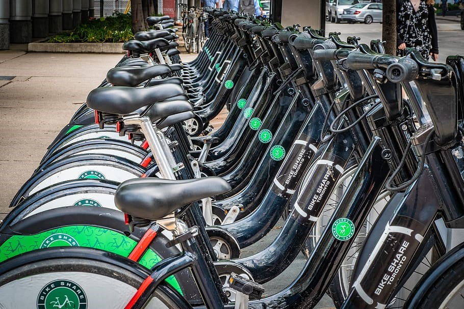
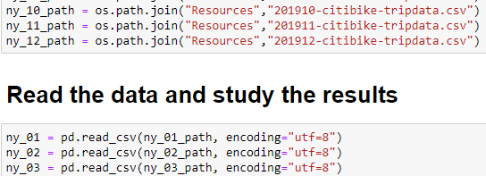
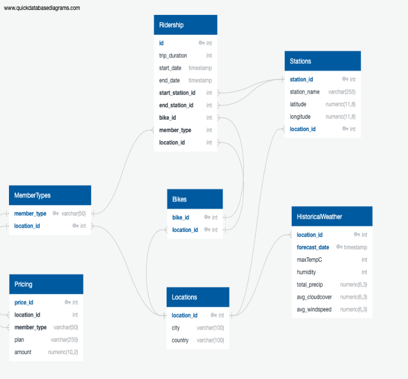
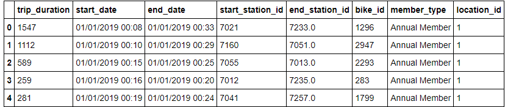
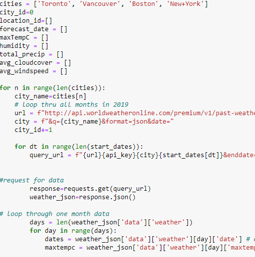

# Project ETL

## Bike Share
Bike-sharing is a form of transportations that has seen a significant increase in usage
globally. The current shift to usage of more sustainable transportation is a
trend that embraces the onset of reducing carbon emissions and allocated
capital investments from urban transport. The onset helps our economy benefits
our economy by encouraging methods in preventing global warming, which in turn
allows us to allocate the extra capital investment into other projects that can
further provide a stable infrastructure. Not only does this program provide
benefits to our economy but it also encourages our public to maintain a healthy
lifestyle

As the Ministry of Transportation, we want to understand the feasibility of implementing a bike-sharing program across Canada. In Canada, we chose two major cities, Toronto & Vancouver, that already have a prototype bike-sharing program implemented and are active in gathering insight on bike-sharing programs. We chose to compare the efficiency of this program from a country with a similar economy as Canada, the US economy.  The two cities, Boston, and New York will be used as a compar-ison sample against Toronto and Vancouver. 

## Extraction

### Data Sources
1. **Trip Data**  
  * ***Toronto*** https://open.toronto.ca/dataset/bike-share-toronto-ridership-data/  
  * ***Vancouver*** https://www.mobibikes.ca/en/system-data  
  * ***Boston*** https://www.bluebikes.com/system-data  
  * ***New York*** https://www.citibikenyc.com/system-data  

2. **Stations**  
  * [Toronto](https://toronto-us.publicbikesystem.net/ube/gbfs/v1/en/station_information)
  * [Vancouver](https://vancouver-gbfs.smoove.pro/gbfs/en/station_information.json)
  * [Boston](https://gbfs.bluebikes.com/gbfs/en/station_information.json)
  * [New York](https://gbfs.citibikenyc.com/gbfs/en/station_information.json)
       

3. **Historical Weather**
  * API calls to https://www.worldweatheronline.com/developer/api/historical-weather-api.aspx
  
4. **Pricing**
   ***Toronto*** https://bikesharetoronto.com/pricing/
  * ***Vancouver*** https://www.mobibikes.ca/en/offers-subscription 
  * ***Boston*** https://www.bluebikes.com/pricing 
  * ***New York*** https://www.citibikenyc.com/pricing
  
  ### Data Modeling & Engineering
 * A database will be created a based on this Entity Relationship Diagram (ERD) that will look at six   main aspects: location, member type, pricing, station, bike, and ridership information. 
 
 

## Transform
 * We will us Jupyter Notebook to combine and clean our data. Steps include:
 
Trip Data

   * drop columns not needed, drop rows with invalid data
   * add primary and composite key id's to tables
   * joining data from multiple sources
   * filtering table to get unique values
   * splitting columns with id information within
   * creating tables available data
   
Station Data

   * Api calls to retrieve station and location data
   * for loop to parse through data for each urul
   
Weather Data:

Pricing Data: 

### Type of final database - relational

### Load

Locations
HistoricalWeather
Stations
Pricing
Bikes
MemberTypes
Ridership
 load only the records where start_station_id and end_station_id exists in Stations table
